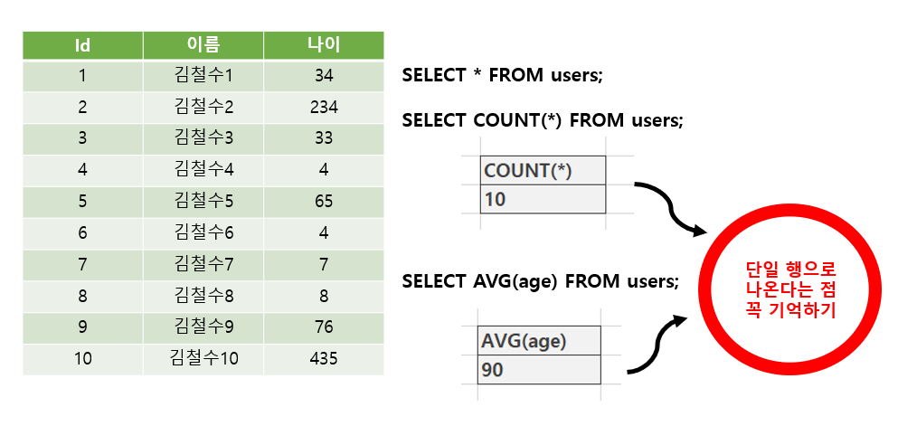
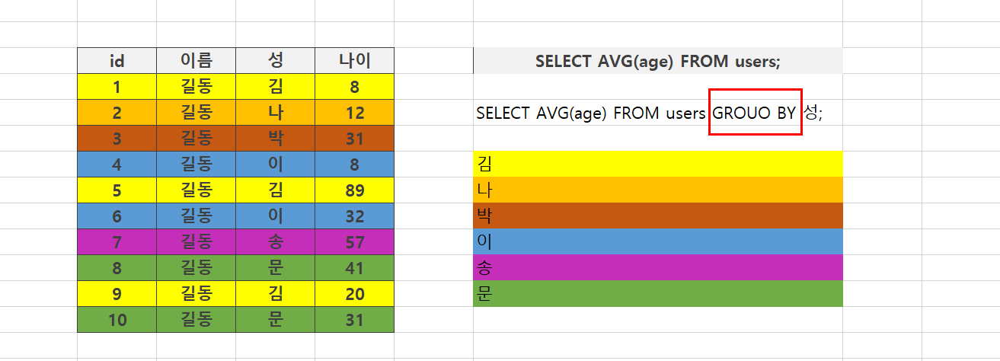
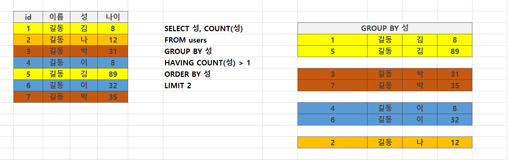
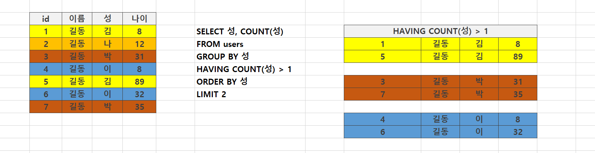

### 🧐 실습 해설 

```sql
-- 5번 문제 
SELECT id, waist FROM healthcare    -- id, waist 내가 보고 싶은 컬럼 지정 
WHERE is_drinking = 1 AND waist != ''      -- 음주를 하는 사람(1)
ORDER BY waist DESC   -- 허리둘레를 높은 순으로 
LIMIT 5;   -- 5명 출력 

-- 같은 표현 
waist != ''
NOT waist = ''
wais <> ''

```


```sql
-- 11번 문제 	
SELECT COUNT(*) FROM healthcare 
WHERE weight/((height*0.01)*(height*0.01)) >= 30;

SELECT id, height, weight, weight/((height*0.01)*(height*0.01))
FROM healthcare 
WHERE weight/((height*0.01)*(height*0.01)) >= 30;
LIMIT 3;

-- BIM 별칭을 사용하여 활용하기
SELECT
	id, 
	height AS 키,
	weight AS 몸무게, 
	weight/((height*0.01)*(height*0.01)) AS BMI
FROM healthcare
WHERE BMI >= 30
LIMIT 3;


```


```sql
-- 12번문제 

SELECT
	id, 
	weight 몸무게,
	height 키,
	weight/((height*0.01)*(height*0.01)) AS BMI
FROM healthcare
WHERE smoking = 3
ORDER BY BMI DESC
LIMIT 5;

```


---


### 📑 기본 함수와 연산 


#### 💡 문자열 함수 

* **SUBSTR(문자열, start, lenght)** : 문자열 자르기 
  * 시작 인덱스 1, 마지막 인덱스는 -1
* **TRIM(문자열), LTRIM(문자열), RTRIM(문자열)** : 문자열 공백 제거 
* **LENGTH(문자열)** : 문자열 길이 
* **REPLACE (문자열, 패턴, 변경값)** : 패턴에 일치하는 부분을 변경
* **UPPER, LOWER** : 대소문자 변경
* **||** : 문자열 합치기 (concatenation)


```sql
SELECT * FROM users LIMIT 1;
-- bash
-- sqlite> .mode column
-- sqlite> SELECT * FROM users LIMIT 1;

-- (1)
-- 문자열 합치기 ||
-- (성+이름), 5명 

-- 어떠한 모습으로 출력이 될지 생각해 보면서 작성해보기 

SELECT 
	last_name \\ first_name 이름,
	age,
	country,
	phone,
	balance
FROM users
LIMIT 5;

```


```sql
-- (2)
-- 문자열 길이 LENGTH

SELECT
	LENGTH(first_name),
	first_name
FROM users
LIMIT 5;


-- (3)
-- 문자열 변경 REPLACE
-- 016-7280-2855 => 01672802855
-- 실제 DB 값을 수정할 수 는 없음 

SELECT
	first_name,
	phone,s
	REPLACE(phone, '-', ' ')
FROM users
LIMIT 5;
```


#### 💡 숫자 함수 

* **ABS(숫자) : 절대값**
* **SIGN(숫자) : 부호 (양수 1, 음수 -1, 0 0)**
* **MOD(숫자1, 숫자2) : 숫자 1을 숫자 2로 나눈 나머지** 
* **CEIL(숫자), FLOOR(숫자), ROUND(숫자, 자리) : 올림, 내림, 반올림**
* **POWER(숫자) : 제곱근** 


```sql
-- 숫자 활용 

SELECT MOD(5, 2)
FROM users
LIMIT 1;

-- 올림, 내림, 반올림

SELECT CEIL(3.14), FLOOR(3.14), ROUND(3.14)
FROM users
LIMIT 1;

-- 9의 제곱근

SELECT SQRT(9)
FROM users
LIMIT 1;

-- 9^2

SELECT POWER(9, 2)
FROM users
LIMIT 1;

```


* **산술 연산자** 

> +, -, *, / 와 같은 산술 연산자와 우선 순위를 지정하는 () 기호를 연산에 활용할 수 있음 

```sql
SELECT age+1 FROM users;
```


---


### 📑 GROUP BY

**_ Agrregate function (집계함수) 다시보기** 

* 값 집합에 대한 계산을 수행하고 **단일 값을 반환**
  * 여러 행으로부터 하나의 결괏값을 반환하는 함수 
* SELECT 구문에서만 사용됨 

> 테이블 전체 행 수를 구하는 **COUNT(*)**
>
> age 컬럼 전체 평균 값을 구하는 **AVG(age)**





* **ALIAS** 

  * 칼럼명이나 테이블명이 너무 길거나 다른 명칭으로 확인하고 싶을 떄는 ALIAS를 활용
  * **AS를 생략하여 공백으로 표현할 수 있음**
  * 별칭에 공백, 특수문자 등이 있는 경우 따옴표로 묶어서 표기 

  ```sql
  SELECT last_name 성 FROM users;
  SELECT last_name AS 성 FROM users;
  SELECT last_name AS 성 FROM users WHERE 성='김'
  ```

  


#### 💡 GROUP BY 

#### (행을 그룹해주는 것이고 각각 집계함수로 넘겨주는 것)

* 지정된 컬럼의 값이 같은 행들로 묶음
* **⭐ 집계함수와 활용하였을 때 의미가 있음**(같이 묶어서 조회해주기 때문)
* 그룹화된 각각의 그룹이 하나의 집합으로 집계함수의 인수로 넘겨짐




**📌 users에서 각 성(last_name) 씨가 몇명이 있는지 확인하시오.** 

```sql
-- group by

-- 성_별 갯수 
SELECT last_name, COUNT(*)
FROM users
GROUP BY last_name;

-- ⭐ group by 에서 활용하는 컬럼을 제외하고는 반드시 집계함수를 사용하세요. 
SELECT last_name, age, COUNT(*)
FROM users
GROUP BY last_name;

SELECT last_name, AVG(age), COUNT(*)
FROM users
GROUP BY last_name;

SELECT last_name, age, COUNT(*)
FROM users
GROUP BY last_name = '곽';


-- GROUP BY는 결과가 정렬되지 않아요. 기존 순서와 바뀜
-- 원칙적으로 내가 정렬해서 보고 싶다면, ORDER BY를 정확하게 사용하는 것이 맞다. 

SELECT *
FROM users
LIMIT 5;

SELECT last_name, COUNT(*)
FROM users
GROUP BY last_name
LIMIT 5;
```


#### 💡 SELECT 문장 실행 순서 

* **FROM => WHERE => GROUP BY => HAVING => SELECT => ORDER BY**

  * FROM  테이블을 대상으로 

  * WHERE 제약조건에 맞춰서 뽑아서 

  * GROUP BY 그룹화 한다. 

  * HAVING 그룹 중에 조건과 맞는 것 만을 

  * SELECT 조회하여 

  * ORDER BY 정렬하고 

  * LIMIT/OFFSET 특정 위치의 값을 가져온다. 

    

```sql
SELECT 칼럼명
FROM 테이블명 
WHERE 조건식
GROUP BY 칼럼 혹은 표현식
HAVING 그룹조건식
ORDER BY 칼럼 혹은 표현식
LIMIT 숫자 OFFSET 숫자;
```








---


```sql
-- GROUP BY 에서 WHERE을 사용하고 싶다면? 

-- 🔴 주의할점
-- 100 이상 등장한 성만 출력하고 싶다.  _ 오류발생 
-- 집계함수 자체의 실행순서로 인해 안됨 _그룹화가 안되어 있기때문에 오류 발생
SELECT last_name, COUNT(last_name)
FROM users
WHERE COUTN(last_name) > 100
GROUP BY last_name


-- 조건에 따른 group 을 하려면 
-- HAVING 을 사용한다. 
SELECT last_name, COUNT(last_name)
FROM users
GROUP BY last_name
HAVING COUNT(last_name) > 100;
```


#### 💡 HAVING

* 집계함수는 WHERE 절의 조건식에서는 사용할 수 없음_실행 순서에 의해 
  * **WHERE 로 처리하는 것이 GROUP BY 그룹화보다 순서상 앞서 있기 때문**
* 집계 결과에서 조건에 맞는 값을 따로 활용하기 위해서 HAVING 을 활용 

```sql
SELECT * FROM 테이블 이름 GROUP BY 컬럼1, 컬럼2
HAVING 그룹 조건;
```


---


### ALTER TABLE

* ALTER TABLE _ 언어별로 차이점이 있다. 

> (1) 테이블 이름변경
>
> (2) 새로운 column 추가 
>
> (3) column 이름수정 (new in sqlite 3.25.0)
>
> (4) column 삭제 (new in sqlite 3.35.0)


```sql
-- 1. 테이블 이름 변경

ALTER TABLE table_name
RENAME TO new_name;

-- 2. 새로운 컬럼 추가 
ALTER TABLE table_name
ADD COLUMN column_definition;

-- 3. 컬럼 이름 수정
ALTER TABLE table_name
RENAME COLUMN current_name TO new_name;

-- 4. 컬럼 삭제 
ALTER TABLE table_name
DROP COLUMN column_name;
```


**📌 tile 과 content 라는 컬럼을 가진 articles 라는 이름의 table을 새롭게 만들어 보세요.**

**(두 컬럼 모두 비어 있으면 안되며 rowid를 사용)**

```sql
CREATE TABLE articles (
title TEXT NOT NULL,
content TEXT NOT NULL
)
```


**📌 articles 테이블에 값 추가하기 (title은 '1번 제목', content는 '1번 내용')**

```sql
INSERT INTO articles VALUES ('1번제목', '1번 내용');
```


---


**◼ 방금 만든 테이블의 이름을 변경 해보자** 

```sql
ALTER TABLE 기존 테이블 이름 RENAME TO 새로운 테이블 이름;
```

```bash
sqlite> ALTER TABLE ✔articles RENAME TO ✔news;
sqlite> .tables
classmates   examples    ✔news      users
```


**◼ 방금 만든 테이블의 새로운 컬럼을 추가해보자**

```sql
ALTER TABLE 테이블 이름 ADD COLUMN 컬럼이름 데이터타입 설정;
```


**◼ 새로운 커럼 이름은 created_at, TEXT 타입에 NULL 설정** 

```sql
ALTER TABLE news ADD COLUMN created_at TEXT NOT NULL;
```

**⁉ 오류 발생 ⁉**

```bash
sqlite> ALTER TABLE news ADD COLUMN created_at TEXT NOT NULL;
Error: Cannot add a NOT NULL column with default value NULL
```


**1️⃣ NOT NULL 설정 없이 추가하기** 

```bash
sqlite> ALTER TABLE news ADD COLUMN created_at TEXT NOT NULL;
sqlite> INSERT INTO news VALUES('제목', '내용', datetime('now'));
sqlite> SELECT * FROM news;

title       content       created_at
--------    ----------    ------------
1번제목 		1번 내용		_______
제목			내용			2021-06-03
```


**2️⃣ 기본 값 (DEFAULT) 설정하기** 

```bash
sqlite> ALTER TABLE news ADD COLUMN  subtitle TEXT NOT NULL DEFAULT '소제목'
sqlite> SELECT * FROM news;

title       content       created_at     subtitle
--------    ----------    ------------   -----------
1번제목 		1번 내용						소제목 (🔻 기본값으로 설정됨)
제목			내용			2021-06-03 		 소제목
```

