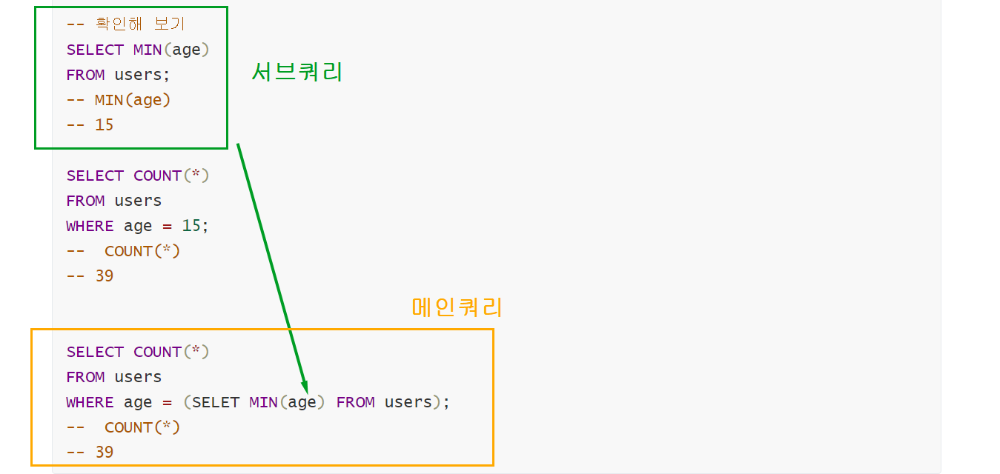

### 🌞 아침 조회 

* HAVIING과 WHERE 의 차이점 정리해두기 

* HAVING은 GROUP BY 와 함께 작성 

* WHERE는 데이터 범위 설정, GROUP BY 의 목적은 정렬이 아닌 그룹화 하는 것 HAVING 은 그룹 내 조건 설정

---

### 💡 CASE

* CASE문은 특정 상황에서 데이터를 변환하여 활용할 수 있음 
* ELSE를 생략하는 경우 NULL 값이 지정됨 

```sql
CASE 
	WHEN 조건식 THEN 식
	WHEN 조건식 THEN TLR
	ELSE 식
CASE
```

**EX) 미세먼지 농도의 구간에 따라서 출력해 보고 싶을 때** 

---

* **gender 1이면 남자고, gender 2 이면 여자이다.**

```sql
-- 단순조회 

SELECT id, gender
FROM healthcare
LIMIT 5;

-- 성별 1(남자), 2(여자)
SELECT 
	id,
	CASE
		WHEN gender = 1 THEN '남자'
		WHEN gender = 2 THEN '여자'
	END
FROM healthcare
LIMIT 5;


-- AS 위치 
SELECT 
	id,
	CASE
		WHEN gender = 1 THEN '남자'
		WHEN gender = 2 THEN '여자'
		-- ELSE
	END AS 성별  -- AS 위치 확인
FROM healthcare
LIMIT 5;


-- 흡연 (smoking)
SELECT DISTINCT smoking 
FROM healthcare;

-- 
SELECT
	id, 
	smoking,
	CASE
		WHEN smoking = 1 THEN '비흡연자'
		WHEN smoking = 2 THEN '흡연자'
		WHEN smoking = 3 THEN '헤비스모커'
		ELSE '무응답'
	END
FROM healthcare;
LIMIT 50;


-- 나이에 따라서 구분 
-- 청소년(~18), 청년(~40), 중장년(~65)
SELECT 
	first_name,
    last_name,
    CASE
    	WHEN age <= 18 THEN '청소년'
    	WHEN age <= 40 THEN '청년'
		WHEN age <= 65 THEN '중장년'
		ELSE '노년'
	END
FROM users
LIMIT 10;

```

---


#### 💡 서브쿼리 

* **서브 쿼리는 특정한 값을 메인 쿼리에 반환하여 활용하는 것**
* **실제 테이블에 없는 기준을 이용한 검색이 가능함** 
* **서브 쿼리는 소괄호로 감싸서 사용하며, 메인 쿼리의 칼럼을 모두 사용 가능**
* **메인 쿼리는 서브** 

```SQL
SELECT *
FROM 테이블
WHERE 컬럼1 = (
	SELECT 컬럼1
	FROM 테이블
)
```


---


#### ◼ 단일행 서브쿼리 

* 서브쿼리의 결과가 0 또는 1 개인 경우
* 단일행 비교 연산자와 함께 사용
  * =, <, >=, >, <>


📌**단일행 서브쿼리 _ USERS에서 가장 나이가 작은 사람의 수는 ? _ WHERE 에서의 활용** 

```sql
-- 가장 나이가 작은 사람의 수 
-- 1
SELECT age, COUNT(*)
FORM users
GROUP BY age 
ORDER BY age 
LIMIT 1;

-- 확인해 보기 
SELECT MIN(age)
FROM users;
-- MIN(age)
-- 15

SELECT COUNT(*)
FROM users
WHERE age = 15;
--  COUNT(*)
-- 39


SELECT COUNT(*)
FROM users
WHERE age = (SELET MIN(age) FROM users);
--  COUNT(*)
-- 39
```




**📌 단일행 서브쿼리 _ USERS에서 평균 계좌 잔고가 높은 사람의 수는?_ WHERE 에서의 활용** 

```sql
-- 직접 작성한 내용 

SELECT COUNT(*)
FROM users
WHERE balance > (SELET AVG(balance) FROM users);

-- 필기내용

SELECT AVG(balance) FROM users;

SELECT COUNT(*)
FROM users
WHERE balance > (SELET AVG(balance) FROM users);
```


---


**📌 단일행 서브쿼리 _ USERS에서 유은정과 같은 지역에 사는 사람의 수는?_ WHERE 에서의 활용** 

```sql
-- 직접 작성한 내용 
SELECT COUNT(*)
FROM users
WHERE '유은정' = (SELET)


-- 필기 내용
SELECT 
	country,
FROM users
WHERE last_name = '유' AND first_name = '은정'

-- (1) 강원도 라는 정보를 얻은 후에 


SELECT COUNT(*)
FROM users
WHERE country = (SELECT country FROM users
WHERE first_name = '은정' AND last_name = '유');
```


**📌 단일행 서브쿼리 _전체 인원과 평균 연봉, 평균 나이를 출력하세요. _ SELECT  활용**

```sql

-- 정답 쿼리 

SELECT  COUNT(*), AVG(balance), AVG(age)
FROM users;

-- 테이블이 여러개가 있다면? 

SELECT 
	(SELECT COUNT(*) FROM users) AS 총인원, 
	(SELECT AVG(balance) FROM users) AS 평균연봉
	(SELECT AVG(age) FROM users) AS 평균나이;
	
	
-- table이 게시글 테이블, 댓글 테이블 

```


**📌 평균잔고로 바꿔 버리는 코드 UPDDATE**_ 단일행

```sql
UPDATE users
SET balance = (SELECT AVG(balance) FROM users);
```


---


### ◼ 다중행 서브쿼리 

* **서브쿼리 결과가 2개 이상인 경우** 
* 다중행 비교 연산자와 함께 사용(**IN, EXISTS** 등_DB마다 다르게 나오기 때문에 주의)


**📌 다중행 서브쿼리_ USERS에서 이은정과 같은 지역에 사는 사람의 수는?** 

```sql
-- 전라북도, 경상북도에 살고 있는 이은정 
-- IN을 사용하기 

SELECT 
	COUNT(*)
FROM users
WHERE country IN (SELECT country FROM users       -- IN 위치 확인 
WHERE last_name = '유' AND first_name = '은정');
```


**📌  특정 성씨에게 가장 어린 사람들의 이름과 나이 모두 출력하시오.**

```sql
-- 내가 작성한 쿼리 
SELECT first_name = '박' COUNT(*) FROM users 
WHERE age, naem IN (SELECT MIN(age) FROM users
WHERE first_name = '박');


-- 정답쿼리 
SELECT 
	last_name,
	MIN(age)
	COUNT(*)
FROM users
GROUP BY last_nmae;

SELECT 
	last_name,
	MIN(age)
	COUNT(*)
FROM users
WHERE (last_name, age) IN (
	SELECT
		last_name,
		MIN(age)
	FROM users
	GROUP BY last_name)
ORDER BY last_name;

```


---


◼ last.sql

```sql
-- AC/DC의 모든 앨범
-- AC/DC (artists)
-- 앨범(albums)

-- ID조회 
SELECT ArtistID
FROM artists
WHERE Name = 'AC/DC';

-- 서브 쿼리 
SELECT * 
FROM albums 
WHERE ArtistID = (SELECT ArtistID FROM artists WHERE Name = 'AC/DC');
```


