### 1. 모든 테이블의 이름을 출력하세요.
```sql
.table
```

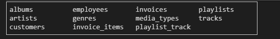

### 2. 모든 테이블의 데이터를 확인해보세요.

```sql
.schema
```


| 공백은 있는지 NULL은 있는지 데이터 타입은 어떤지 등등 데이터를 직접 확인해보세요.


### 3. 앨범(albums) 테이블의 데이터를 출력하세요.
| 단, `Title`을 기준으로 내림차순해서 5개까지 출력하세요.

```sql
SELECT * FROM albums ORDER BY Title DESC LIMIT 10;
```

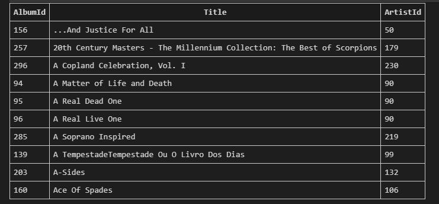

### 4. 고객(customers) 테이블의 행 개수를 출력하세요.

| 단, 컬럼명을 `고객 수`로 출력하세요.

```sql
SELECT COUNT(*) FROM customers;
```

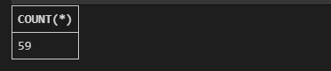


### 5. 고객(customers) 테이블에서 고객이 사는 나라가 `USA`인 고객의 `FirstName`, `LastName`을 출력하세요.

| 단, 각각의 컬럼명을 `이름`, `성`으로 출력하고, `이름`을 기준으로 내림차순으로 5개까지 출력하세요.

```sql
SELECT FirstName AS '이름', LastName AS '성' FROM customers
WHERE Country = 'USA'
ORDER BY FirstName DESC
LIMIT 5;
```

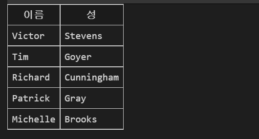

### 6. 송장(invoices) 테이블에서 `BillingPostalCode`가 `NULL` 이 아닌 행의 개수를 출력하세요.

| 단, 컬렴명을 `송장수`로 출력하세요.

```sql
SELECT COUNT(*) AS '송장수'
FROM invoices
WHERE BillingPostalCode NOT NULL;
```

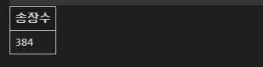

### 7. 송장(invoices) 테이블에서 `BillingState`가 `NULL` 인 데이터를 출력하세요.

| 단, `InvoiceDate`를 기준으로 내림차순으로 5개까지 출력하세요.
```sql
SELECT *
FROM invoices
WHERE BillingState IS NULL
ORDER BY invoiceDate DESC
LIMIT 5;
```

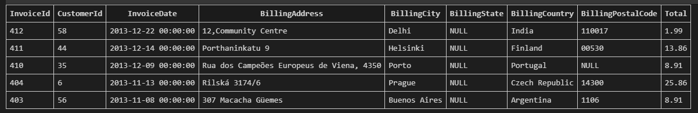

### 8. 송장(invoices) 테이블에서 `InvoiceDate`의 년도가 `2013`인 행의 개수를 출력하세요.

| `strftime`를 검색해서 활용해보세요.

```sql
SELECT COUNT(*) AS '2013년도인 행 개수'
FROM invoices
WHERE STRFTIME ('%Y', InvoiceDate) = '2013';
```

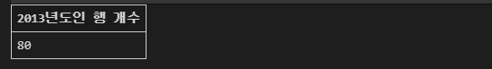

### 9. 고객(customers) 테이블에서 `FirstName`이 `L` 로 시작하는 고객의 `CustomerId`, `FirstName`, `LastName`을 출력하세요.

| 단, 각각의 컬럼명을 `고객ID`, `이름`,`성`으로 출력하고, `고객ID`을 기준으로 오름차순으로 출력하세요.

```sql
```

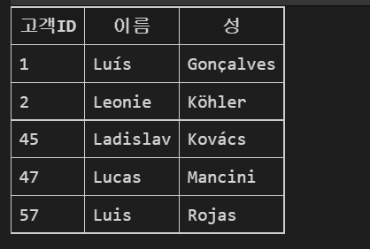

### 10. 고객(customers) 테이블에서 각 나라의 고객 수와 해당 나라 이름을 출력하세요.

| 단, 각각의 컬렴명을 `고객 수`,`나라`로 출력하고, 고객 수 상위 5개의 나라만 출력하세요.

```sql
SELECT COUNT(*) AS '고객 수', Country AS '나라' FROM customers 
GROUP BY Country 
ORDER BY '고객 수' DESC LIMIT 5;
```

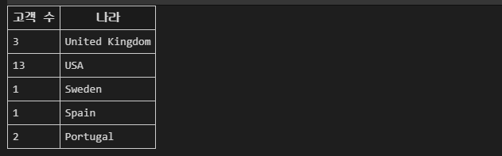

### 11. 앨범(albums) 테이블에서 가장 많은 앨범이 있는 Artist의 `ArtistId`와 `앨범 수`를 출력하세요.

```sql
SELECT ArtistId, COUNT(*) AS '앨범 수' 
FROM albums
GROUP BY ArtistId
ORDER BY COUNT(*) DESC LIMIT 1;
```


### 12. 앨범(albums) 테이블에서 보유 앨범 수가 10개 이상인 Artist의 `ArtistId`와 `앨범 수` 출력하세요

| 단, 앨범 수를 기준으로 내림차순으로 출력하세요.

```sql 
SELECT ArtistId, COUNT(*) AS '앨범수'
FROM albums
GROUP BY ArtistId
HAVING '앨범 수' >= 10
ORDER BY '앨범 수' DESC;

-- 1~81까지 확인됨
```

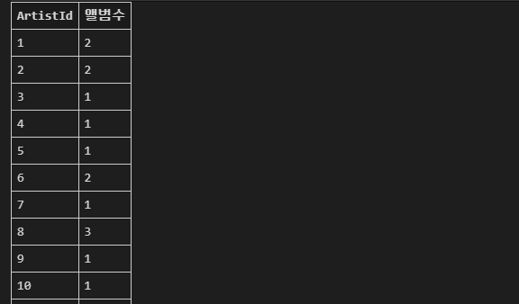


### 13. 고객(customers) 테이블에서 `State`가 존재하는 고객들을 `Country` 와 `State`를 기준으로 그룹화해서 각 그룹의 `고객 수`, `Country`, `State` 를 출력하세요.

| 단, `고객 수`, `Country` 순서 기준으로 내림차순으로 5개까지 출력하세요.

```sql 
SELECT COUNT(*) AS '고객 수', Country, State FROM customers
WHERE State NOTNULL
GROUP BY Country, State
ORDER BY '고객 수', Country DESC
LIMIT 5;
```

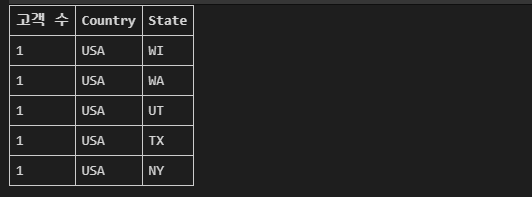

### 14.  고객(customers) 테이블에서 `Fax` 가 `NULL`인 고객은 'X' NULL이 아닌 고객은 'O'로 `Fax 유/무` 컬럼에 표시하여 출력하세요.

| 단, `CustomerId`와 `Fax 유/무` 컬럼만 출력하고, `CustomerId` 기준으로 오름차순으로 5개까지 출력하세요. 

```sql 
SELECT 
    CustomerId, 
    CASE
        WHEN Fax ISNULL THEN 'X'
        ELSE '0'
        END AS 'Fax 유/무'
FROM customers 
ORDER BY CustomerId ASC
LIMIT 5;
```

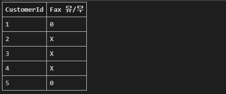


### 15. 점원(employees) 테이블에서 `올해년도 - BirthDate 년도 + 1` 를 계산해서 `나이` 컬럼에 표시하여 출력하세요.

| 단, 점원의 `LastName`, `FirstName`, `나이` 컬럼만 출력하고, `EmployeeId`를 기준으로 오름차순으로 출력하세요.

| cast(), strftime(), 오늘 날짜를 구하는 함수를 검색하고, 활용해보세요.
```sql 
SELECT LastName, FirstName,
    (CAST(STRFTIME('%Y', 'now') AS INT) - CAST(STRFTIME('%Y', BirthDate) AS INT)) + 1
    AS '나이'
FROM employees
ORDER BY EmployeeId ASC;
```

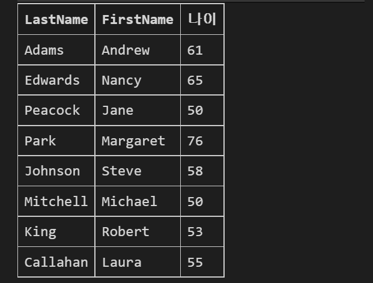

### 16. 가수(artists) 테이블에서 앨범(albums)의 개수가 가장 많은 가수의 `Name`을 출력하세요.

| artists 테이블과 albums 테이블의 `ArtistId` 활용하세요.

```sql 
SELECT Name FROM artists WHERE ArtistId = (
    SELECT
        ArtistId
    FROM albums
    GROUP BY ArtistId
    ORDER BY COUNT(*) DESC
    LIMIT 1
);
```

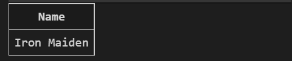

### 17. 장르(genres) 테이블에서 음악(tracks)의 개수가 가장 적은 장르의 `Name`을 출력하세요.

| genres 테이블과 tracks 테이블의 `GenreId` 활용하세요.
```sql 
SELECT Name 
FROM genres 
WHERE GenreId = (
    SELECT GenreId
    FROM(
        SELECT
            GenreId,
            COUNT(*) AS '개수'
            FROM tracks
            GROUP BY GenreId
            ORDER BY '개수' ASC
            LIMIT 1
      )
);
```

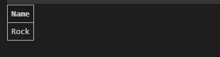

### 자유롭게 문제를 만들어 보시고, 디스코드 채널에 공유해보세요!

