#### ⭐ 설명하기 _ 자신이 직접 설명하는 것 _ 막힘없이 설명하는 지식 = 진짜 지식 _메타인지

---


### ✔ SQL JOIN 

* **INNER JOIN**(주로 많이 사용) : 두 테이블에 모두 일치하는 행만 반환 
* **OUTER JOIN**(주로 많이 사용) : 동일한 값이 없는 행도 반환
* **CROSS JOIN** : 모든 데이터의 조합 


---


#### 🔵 INNER JOIN _ 두 테이블에 모두 일치하는 행만 반환 

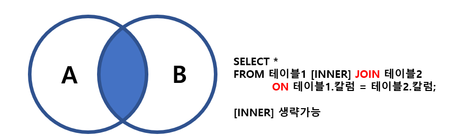

```sql
-- 📌사용자 USERS와 각각의 역할을 출력하시오. 

SELECT *
FROM users INNER JOIN role
ON users.role_id = role.id;

-- INNER 생략 가능 
SELECT *
FROM users JOIN role
ON users.role_id = role.id;
```


```sql
-- 📌 staff(2) 사용자 (users)를 역할과 함께 출력하시오.

SELECT 
FROM users,INNER JOIN role
	ON users.role.id = role.id
WHERE role.id = 2;

-- 📌이름을 내림차순으로 출력하세요. 

SELECT 
FROM users,INNER JOIN role
	ON users.role.id = role.id
ORDER BY users.name DESC;SS
```


---


#### 🔵 **OUTER JOIN** _ 동일한 값이 없는 행도 반환

> 기준이 되는 테이블에 따라 LEFT/RIGHT/FULL을 지정 

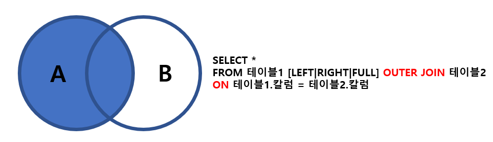

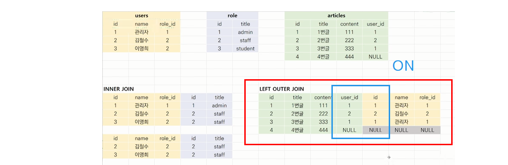

**📌 LEFT OUTER JOIN _위와 같은 결과가 나오도록 쿼리 쿼리 작성**

```sql
-- 위와 같은 결과가 나오는 쿼리 작성 

SELECT *
FROM articles LEFT OUTER JOIN users
	ON articles.user_id = users.id;
	
-- null을 뺴고 싶다면?_ 삭제 개념이 아닌 조회한다는 개념으로 다가가기 S

SELECT *
FROM articles LEFT OUTER JOIN users
	ON articles.user_id = users.id
WHERE articles.user_id IS NOT NULL;


-- 실습_ 예시

-- 1. 앨범, 아티스트 아이디 결합

SELECT * 
FROM albums JOIN artists
	ON albums.ArtistID = artists.ArtistID;
LIMIT 5; -- 양이 많을 경우 

-- 2. LEFT JOIN 

SELECT * 
FROM albums LEFT JOIN artists
	ON albums.ArtistID = artists.ArtistID;
LIMIT 5; -- 양이 많을 경우 
```

---

#### **⁉ 주의하기 ⁉** 

**이영희는 작성한 글이 없고, 4번글을 작성자가 없음 _빨강색 글씨 _ 주의해서 봐야하할 데이터** 

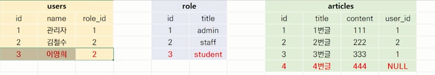

#### **⁉ 중복된 것 삭제 ⁉  _ **

**FULL OUTER는 중복 제거 여부에 따라 WHERE가 추가가 되는지 아닌지에 따름** 

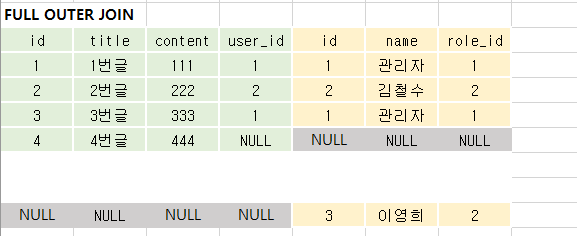


```sql
-- 📌 작성자가 있는 모든 게시글을 사용자 정보와 함께 출력하시오.

SELECT * 
FROM articles LEFT OUTER JOIN users
	ON users.id = articles.user-id
WHERE articles.user_id IS NOT NULL;

-- 📌 작성자가 있는 모든 게시글을 사용자 정보와 함께 출력하시오.

SELECT *
FROM articles FULL OUTER JOIN users
	ON users.id = articles.user_id;
```


---


#### 🔵 CROSS JOIN _ 모든 가능한 경우의 수의 JOIN 

```sql
SELECT *
FROM 테이블1 CROSS JOIN 테이블2;
```


```sql
-- CROSS JOIN

SELECT *
FROM users CROSS JOIN role;
```


```sql
-- 모든 게시글과 모든 사용자 정보를 출력하시오. 
 
SELECT *
FROM articles FULL OUTER JOIN users
	ON users.id = articles.user_id;
```


```sql
-- users 와 role의 CROSS JOIN 출력 결과 

SELECT *
FROM users CROSS JOIN role;
```


---


### 💡 Join 

* 관계형 데이터베이스의 가장 큰 장점이자 핵심적인 기능 
* 일반적으로 데이터베이스에는 하나의 테이블에 많은 데이터를 저장하는 것이 아니라 여러 테이블로 나눠 저장하게 되며, 
* 여러 테이블을 결합(Join)하여 출력하여 활용
* 일반적으로 레코드는 기본키PK 나 외래키FK값의 관계에 의해 결합함 


```sql
-- 홍길동이 작성한 모든 질문 
SELECT title, content FROM 질문 WHERE 작성자 = '홍길동';

-- 문제점 : 작성자가 동명이인 일 수도 있다. 
-- 문제점 : 홍길동이 이름을 바뀌었다면 변경해야 한다. 
-- 문제점 : STUDENT를 학생으로 바꾸고 싶다면 해당사항을 모두 변경해야 한다. 

```

* 질문 ID, TITLE, CONTENT를 그대로 만들어주고 유저라는 테이블에 별도로 관리가 되어있다고 한다면,

  * 유저 아이디를 질문 테이블을 넣어준다. **USER_ID = FK**

  * FK 를 통해 유저 정보를 알 수 있다. 

  * 유저의 역할 역시도 따로 분리를 하여 관리를 할 수 있다. 

  * **ROLE_ID = FK**

    

    * 따라서 
    * FK로 관리한다면 USER NAME이 변경이 되어도 쉽게 변경이 가능하다.
    * 장단점이 있다. _단점 중에 나눠서 말고 조합하여 만들고 싶다.
    * **2개의 테이블을 조합하여 만들고 싶다. = JOIN**


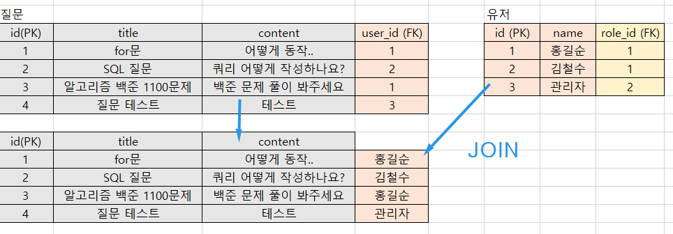

---


* **EX) 노래 정보 _ 노래 정보를 어떻게 저장할 수 있을까?**
  * 실제 여러 테이블이 구분이 되어져서 관리가 되어져 있고 이 많은 테이블을 조합하는 과정을 통해 데이터를 추출해 나갈 수 있다.

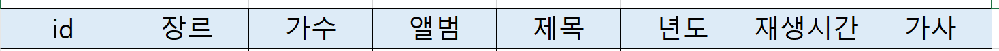

* **어떻게 관리 할 수 있을까?** 

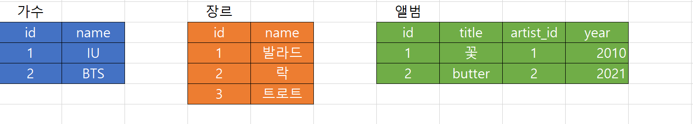


---


* **실습용 테이블 생성**

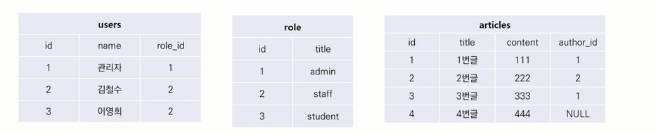

```sql
CREATE TABLE users(
	id INT PRIMMARY KEY,
    name TEXT,
    role_id INT
);

INSERT INTO users VALUES
	(1, '관리자', 1),
	(2, '김철수', 2),
	(3, '이영희', 3),
-- 알 수 있는 점 ) 
-- 김철수와 이영희는 모두 STAFF이고 관리자는 ADMIN으로 알 수 있다. 
```


```sql
CREATE TABLE role (
	id INT PRIMMARY KEY,
    title TEXT,
    content TEXT,
    user_id INT
);

INSERT INTO users VALUES
	(1, '1번글', '111', 1),
	(2, '2번글', '222', 2),
	(3, '3번글', '333', 1),
	(4, '4번글', '444', NULL);
	
-- 확인 
.mode column
SELECT * FROM users;
SELECT * FROM role;
SELECT * FROM articles;
```


---


* **수업 실습**

```sql
-- A와 B테이블에서 값이 일치하는 것들만 

SELECT *
FROM USERS JOIN role
	ON users.role_id = role.id;
```

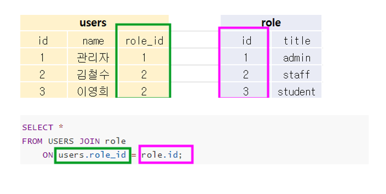


```sql
-- 만약 내가 원하는 것들만 보고 싶다면? 
-- * 자리만 변경해주면 된다. 

SELECT users.name, role.title
FROM users INNER JOIN role
	ON users.role_id = role.id;

-- 2개의 테이블을 join 하고 싶다면, join을 1번 사용, 3개의 테이블을 join하고 싶다면 2번 사용
```


---

#### ✔ [join vs 서브 쿼리](https://kimsyoung.tistory.com/entry/SUBQUERY-%EC%99%80-JOIN-%EC%9D%98-%EC%B0%A8%EC%9D%B4-%E4%B8%8A)

> 서브 쿼리는 복잡한 sql 쿼리문에 많이 사용되며 보통 메인 쿼리라고 부르는 외부 쿼리가 있고 외부 쿼리 내에 다른 쿼리문 즉, 내부 쿼리가 있는 구조이다. 
>
> 서브 쿼리의 구조는 내부 쿼리가 외부 쿼리의 열에 의존하지 않으며 내부 쿼리만으로도 충분히 실행이 가능해야 합니다. 반면 복잡한 형태의 서브 쿼리는 내부 쿼리가 외부 쿼리의 열에 의존합니다. 즉, 내부 쿼리만으로 쿼리가 실행이 불가능 하다는 뜻이다. 
>
> * [서브 쿼리의 종류](https://kimsyoung.tistory.com/entry/%EC%84%9C%EB%B8%8C-%EC%BF%BC%EB%A6%AC%EC%9D%98-%EC%A2%85%EB%A5%98%EC%97%90%EB%8A%94-%EB%AC%B4%EC%97%87%EC%9D%B4-%EC%9E%88%EC%9D%84%EA%B9%8C) 
>
> join은 여러개의 쿼리를 필요로 하지 않습니다. 조인의 역할은 2개 혹은 그 이상의 테이블을 연결하고, 연결한 테이블로부터 필요한 열을 조회할 수 있습니다. 

> 서브쿼리와 join 모두 여러개의 테이블로부터 데이터를 추출하기 위한 복잡한 쿼리문에 사용이 되지만 이 둘의 데이터를 추출하기 위한 접근 방식은 다릅니다. 


---


#### [SQL_JOINS_VISUALIZER]([SQL Joins Visualizer (leopard.in.ua)](https://sql-joins.leopard.in.ua/))

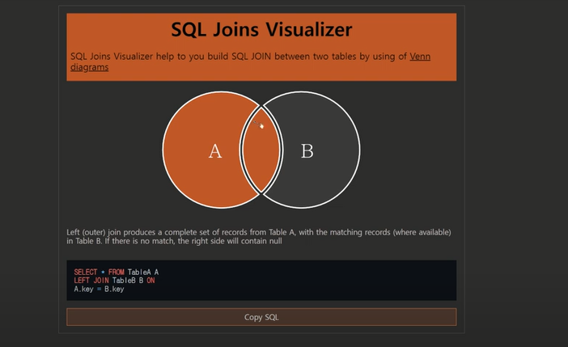


---


#### ✔ 예습 

 [**ERD_객체 관계 다이어그램**](https://velog.io/@fantastik/44)

 **현황을 한눈에 볼수 있는 방법 _ ERD_객체 관계 다이어그램**


* **관계선**
  * ERD에서 각 객체간의 관계는 '관계선'으로 표시합니다. 각 객체가 어떤 관계를 갖고 있는지가 중요 
  * 두 객체 간 관계의 종류에는 '일대다 관계', '다대다 관계', '다대다 관계'
  * 객체 간 관계를 파악할 때 _ 객체 A와 B의 관계가 어떠한 지 확인할 때 
  * 몇개의 A 객체가 몇 개의  B 객체를 가질 수 있는지 생각하면 편하다. 


* **일대 다 관계 (1 : N 관계)**

  * 하나의 A가 여러개의 B를 가질 수 있고, 하나의 B는 하나의 에만 포함된다. 
  * 하나의 회원이 여러개의 가계부 정보를 생성할 수 있지만, 하나의 가계부 정보는 단 한 명의 회원에게만 귀속 됩니다. 이럴 경우 회원과 가계부 정보간 관계는 1: N 관계이다. 

  

* **다대 다 관계 (M:N 관계)**

  * 하나의 A가 여러 개의 B를 가질 수 있고, 하나의 B가 여러개의 A를 가질 수 있다 . (포함될 수 있다.)
  * 하나의 회원이 여러 종류의 지불방식을 가질 수 있습니다.
  * 두 객체가 다대다 관계라면 **반드시 다대다 관계를 풀어줘야 합니다.** 다대다 관계를 풀어주려면 두 객체(A, B) 사이에 관계를 풀어주는 A-B 객체를 두면 됩니다.


#### [개체-관계 모델](https://ko.wikipedia.org/wiki/%EA%B0%9C%EC%B2%B4-%EA%B4%80%EA%B3%84_%EB%AA%A8%EB%8D%B8)

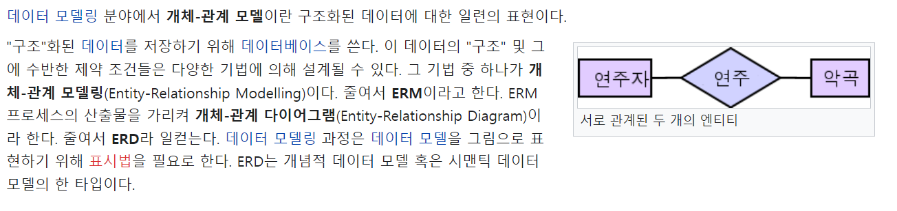