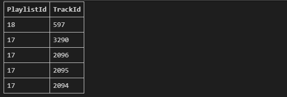
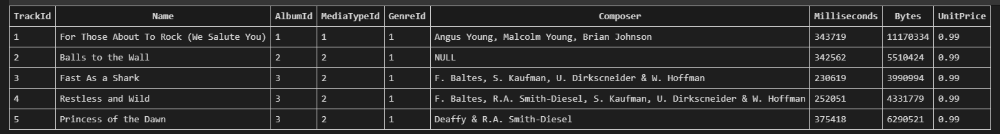
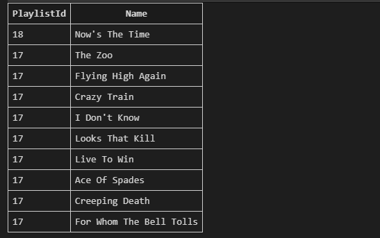
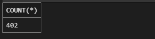
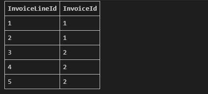
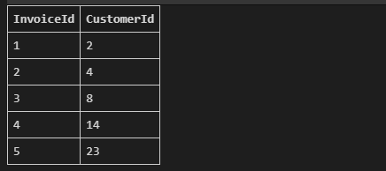
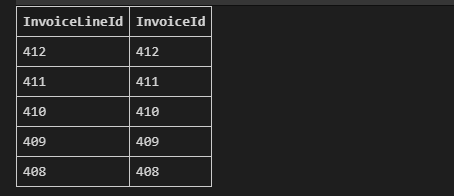
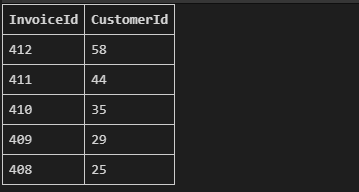

### 1. playlist_track 테이블에 `A`라는 별칭을 부여하고 데이터를 출력하세요.
| 단, 모든 컬럼을 `PlaylistId` 기준으로 내림차순으로 5개만 출력하세요.

```sql
SELECT * 
FROM playlist_track AS A
ORDER BY PlaylistId DESC
LIMIT 5;
```




### 2. tracks 테이블에 `B`라는 별칭을 부여하고 데이터를 출력하세요

| 단, 모든 컬럼을 `TrackId` 기준으로 오름차순으로 5개만 출력하세요.
```sql
SELECT *
FROM tracks AS B
ORDER BY TrackId ASC
LIMIT 5;
```




### 3. 각 playlist_track 해당하는 track 데이터를 함께 출력하세요.

| 단, PlaylistId, Name 컬럼을 `PlaylistId` 기준으로 내림차순으로 10개만 출력하세요. 

```sql
SELECT PlaylistId, Name
FROM playlist_track AS P INNER JOIN tracks AS T 
    ON P.TrackId = T.TrackId
ORDER BY P.PlaylistId DESC
LIMIT 10;
```



### 4. `PlaylistId`가 `10`인 track 데이터를 함께 출력하세요. 

| 단, PlaylistId, Name 컬럼을 `Name` 기준으로 내림차순으로 5개만 출력하세요.
```sql
SELECT P.PlaylistId, T.Name
FROM playlist_track AS P INNER JOIN tracks AS T
    ON P.TrackId = T.TrackId
WHERE P.PlaylistId = 10
ORDER BY T.Name DESC
LIMIT 5;
```


### 5. tracks 테이블을 기준으로 tracks `Composer` 와 artists 테이블의 `Name`을 `INNER JOIN`해서 데이터를 출력하세요.

| 단, 행의 개수만 출력하세요.

```sql
SELECT COUNT(*)
FROM tracks AS T INNER JOIN ARTISTS AS A
    ON T.Composer = a.Name;
```



### 6. tracks 테이블을 기준으로 tracks `Composer` 와 artists 테이블의 `Name`을 `LEFT JOIN`해서 데이터를 출력하세요.

| 단, 행의 개수만 출력하세요.
```sql
SELECT count(*)
FROM tracks AS T LEFT OUTER JOIN artists AS A
    ON T.Composer = A.Name;
```


### 7. `INNER JOIN` 과 `LEFT JOIN` 행의 개수가 다른 이유를 작성하세요.

```plain
INNER JOIN 의 경우 테이블의 값들 중 NULL 값이 있는 레코드들이 조회가 되지 않는다. 
LEFT JOIN의 경우 테이블 1을 기준으로 NULL값이 있는 레코드들도 함께 조회된다. 
```

### 8. invoice_items 테이블의 데이터를 출력하세요.
| 단, InvoiceLineId, InvoiceId 컬럼을 `InvoiceId` 기준으로 오름차순으로 5개만 출력하세요.
```sql
SELECT InvoiceLineId, InvoiceId
FROM invoice_items
ORDER BY InvoiceId ASC
LIMIT 5;
```



### 9. invoices 테이블의 데이터를 출력하세요.

| 단, InvoiceId, CustomerId 컬럼을 `InvoiceId` 기준으로 오름차순으로 5개만 출력하세요.
```sql
SELECT InvoiceId, CustomerId 
FROM invoices
ORDER BY InvoiceId ASC
LIMIT 5;
```



### 10. 각 invoices_item에 해당하는 invoice 데이터를 함께 출력하세요.

| 단, InvoiceLineId, InvoiceId 컬럼을 `InvoiceId` 기준으로 내림차순으로 5개만 출력하세요.

```sql
SELECT 
    invoice_items.InvoiceLineId,
    invoices.InvoiceId
FROM invoice_items INNER JOIN invoices
    ON invoice_items.InvoiceLineId = invoices.InvoiceId
ORDER BY invoices.InvoiceId DESC
LIMIT 5;
```



### 11. 각 invoice에 해당하는 customer 데이터를 함께 출력하세요.

| 단, InvoiceId, CustomerId 컬럼을 `InvoiceId` 기준으로 내림차순으로 5개만 출력하세요.
```sql
SELECT
    I.InvoiceId,
    C.CustomerId
FROM invoices AS I INNER JOIN customers AS C
    ON I.CustomerId = C.CustomerId
ORDER BY I.InvoiceId DESC
LIMIT 5;
```



### 12. 각 invoices_item(상품)을 포함하는 invoice(송장)와 해당 invoice를 받을 customer(고객) 데이터를 모두 함께 출력하세요.

| 단, InvoiceLineId, InvoiceId, CustomerId 컬럼을 `InvoiceId` 기준으로 내림차순으로 5개만 출력하세요.
```sql
SELECT A.InvoiceLineId, A.InvoiceId, C.CustomerId
FROM invoice_items A
    INNER JOIN invoices B
        ON A.InvoiceId = B.InvoiceId
    INNER JOIN customers C
        ON B.CustomerId = C.CustomerId
ORDER BY A.InvoiceId DESC
LIMIT 5;
```


### 13. 각 cusotmer가 주문한 invoices_item의 개수를 출력하세요.

| 단, CustomerId와 개수 컬럼을 `CustomerId` 기준으로 오름차순으로 5개만 출력하세요.
```sql
SELECT C.CustomerId, COUNT(*) 
FROM invoice_items A 
INNER JOIN (
    SELECT * FROM invoices A
    INNER JOIN customers B
    ON A.CustomerId = B.CustomerId
) C
ON A.InvoiceId = C.InvoiceId
GROUP BY C.CustomerId
ORDER BY C.CustomerId ASC
LIMIT 5;
```


