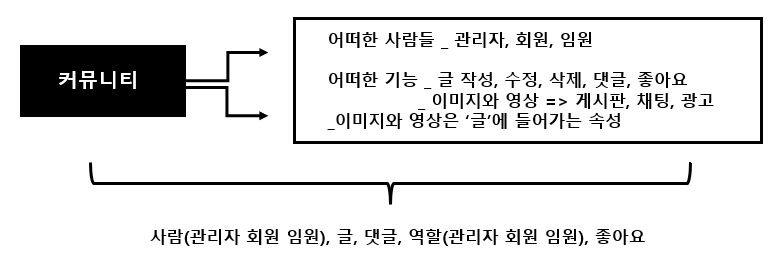
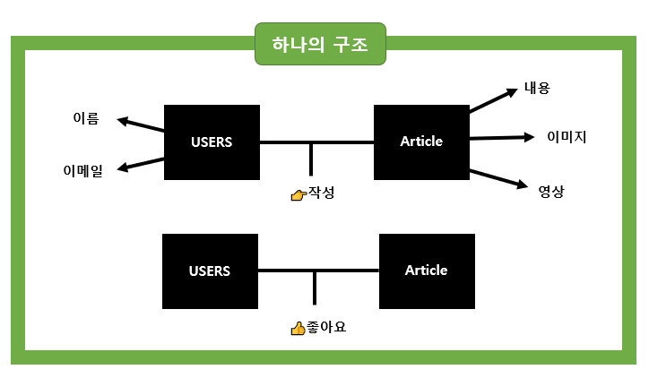
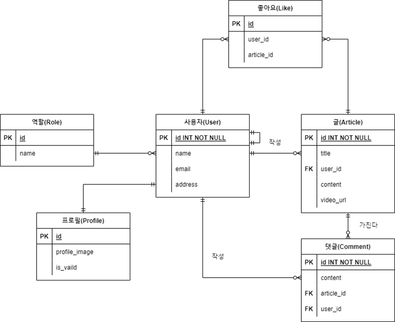
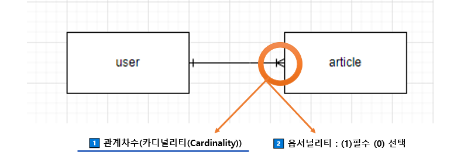
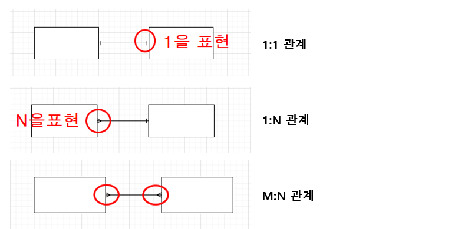
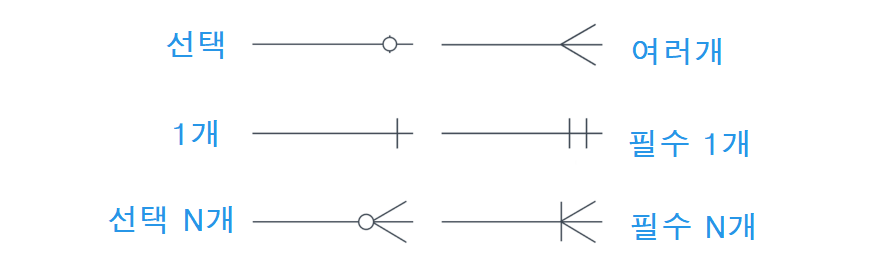
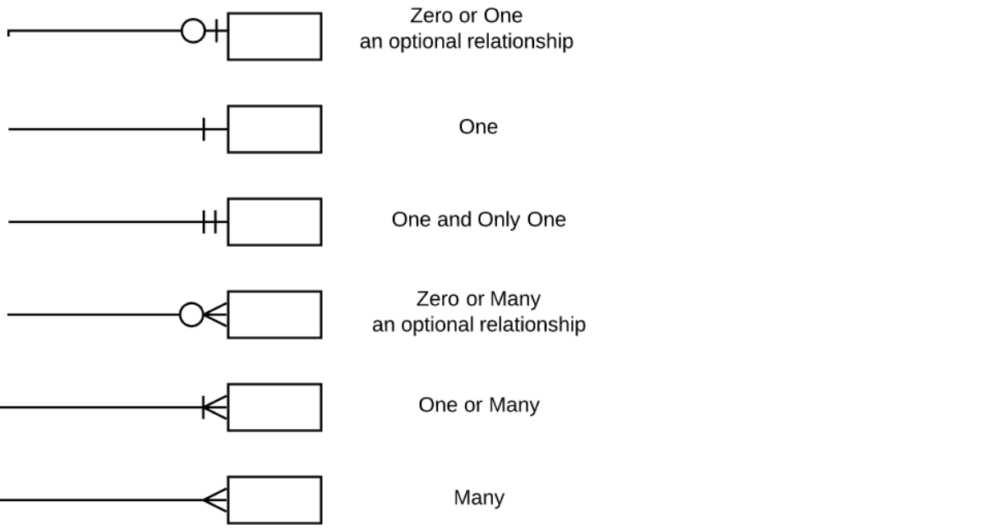

🌞 **혼자 노트나 메모장에 설명하면서 작성해보기** 

**🌞 본인은 무엇을 해야 잘했다 라고 생각하시나요? 그 정도는 어디인가요?**

🌞 **본인은 이해를 했다를 어떤 근거로 생각하시나요?** 

---

## ✔ 모델링

> 데이터베이스의 구조나 형식으로 모델 구조만 보고 어떤 데이터를 다루는지 알 수 있음 

◼ **개념적 데이터 모델링** : 데이터의 요구사항을 찾고 분석하는 과정, 핵심 개체 entity 사이의 관계를 찾아내고 표현_ 어플을 사용하는 users 가 어떤 형식으로 게시글을 남기는지 어떻게 사용하는지

◼  **논리적 데이터 모델링** : 데이터베이스 설계 프로세스의 과정으로 정보의 논리적인 구조와 규칙을 명확하게 표현하는 기법/과정 

◼  **물리적 데이터 모델링** : 논리적 데이터 모델이 데이터 저장소로서 어떻게 실제로 저장될 것인가

### 💡 ERD(Entity Relationship Diagram) _개체 관계 모델 

* 엔터티(Entity) : 업무가 관여하는 정보
* 속성(Attribute) : Entity가 가지는 성격, 데이터 타입과 크기 및 제약사항 지정
* 관계(Relationship) : Entity 간의 관계, 연관성

◼ 사람들이 많은 글을 작성합니다. ◼  글은 사람들이 작성합니다.  ◼  글은 댓글들을 가지고 있어요 

◼  글은 이미지, 영상, 내용을 포함합니다.  ◼  댓글은 사람이 작성해요. 글이 있어야만 해요.

◼  사람들은 역할을 가지고 있습니다.   ◼  사람들이 글에 좋아요를 누릅니다. 

◼  글은 사람들에 의해서 좋아요를 받습니다. 

**📌 '좋아요' 는 어떻게 관계도를 그려야 할까?** 

* **사용자와 좋아요는 1:N 이며, 좋아요와 글도  1:N 이다.**
* **사용자와 글은 M:N 이다.** 

---

---

### 💡 Crow’s feet 

---

---

---

### 💡 정규화 

##### **데이터베이스 테이블을 설계하는 과정에서 중복성을 제거하여 성능을 향상** _테이블 쪼개기

* 정규화 종류 
  * **제 1 정규화 : 도메인 원자값** 
    * 한 속성에 여러 개의 속성이 포함, 같은 유형의 속성이 여러 개로 나눠져 있는 경우 제거 
  * **제 2 정규화 : 부분적 함수 종속성 제거** 
    * PK가 아닌 모든 칼럼은 PK에 종속되도록 구성
  * **제 3 정규화 : 이행적 함수 종속성 제거 (X->Y, Y->Z)**
    * 일반 속성 간의 함수 종속 관계가 존재하지 않아야 함

#### [* 참고자료](https://hoyeonkim795.github.io/posts/normalization-course/)

