### 🌞 아침 조회 시간 _ 모델링 실습 


**강의 다시보기와 과제가 속성일 뿐이다.** 

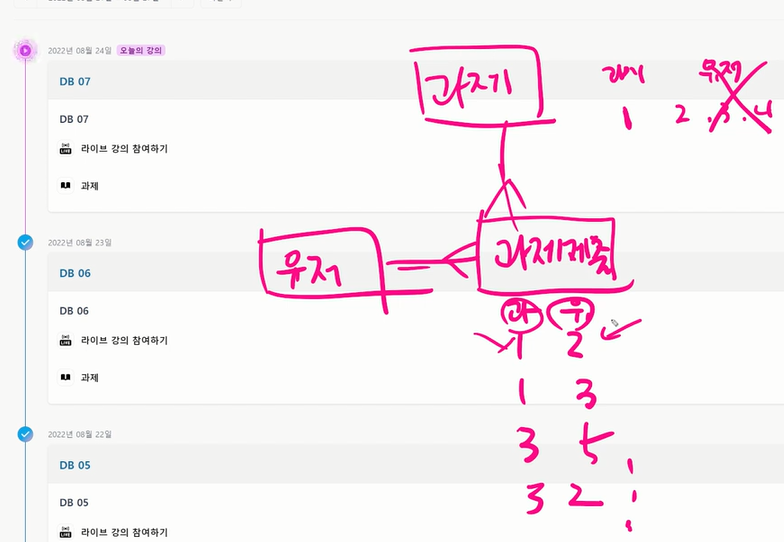

**과제제출도 하나의 과제에 대해 여러 사용자가 각각 제출한다는 점을 참고하기** 

---


### ✔ ORM 

* 파이썬으로 데이터 베이스를 조작하는 것이다.  Object(객체) Relational Mapping _ "**객체로 DB를 조작한다."** 

```sql
Genre.object.all()

-- 결과는? : 파이썬에서 사용할 수 있는 데이터 타입으로 변형하여 나온다.
-- 클래스로 정의해 놓고 설계를 한다. 
```

* 객체 지향 프로그래밍 언어를 사용하여 호환되지 않는 유형의 시스템 간의 데이터를 변환하는 프로그래밍 기술 
* 파이썬에서는 SQLAchemy, peewee 등 라이브러리가 있으며 Django 프레임 워크에서는 내장 Django ORM 을 활용


### ✔ 모델 설계 

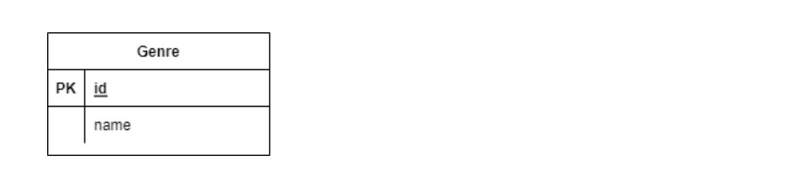

**(1) 클래스를 생성하여 내가 원하는 DB의 구조를 만든다.** 

```python
import pastats
from django.db import models 

# Genre 클래스를 만드는데, mode-s.Mode 내부 클래스를 상속받는다. 
# 왜 상속 받을 까요? 기능들을 활용하고 싶어서 _ 미리 만들어진 

class Genre(models.model):
	name = models.charfield(max_length=30)
	
# varchar(30) 
# varchar 유형은 가변 길이 이므로 필요한 영역은 실제 데이터 크기뿐이다. 
# char(s) : 고정 길이 문자열 정보, s 만큼 최대 길이를 갖고 고정 길이를 가지고 있으므로 할당된 변수 값의 길이가 s보다 작을 경우에는 그 차이 길이만큼 공간으로 채워진다. 
# VARCHAR : CHARACTER VARYING 의 약자로 _ 가변 길이 문자열 정보 
# numeric : 정수, 실수 등 숫자 정보 (오라클과 sql 에서 차이점이 있음_주의)
# DATE : 날짜와 시각 정보 

Class Person:
	pass
# iu라고 하는 변수의 이름을 가진 Person 클래스의 인스턴스를 만드는 코드는? 
iu = Person()
# iu의 name 속성으로 아이유 라고 하는 코드는? 
iu.name = '아이유'
```


**(2) 모델 설계 및 반영** 

* 클래스를 생성하여 내가 원하는 DB의 구조를 만든다. 
* **클래스의 내용**으로 데이터베이스에 반영하기 위한 **마이그레이션 파일을 생성**한다. 

```bash
$ python manage.py makemigrations
```

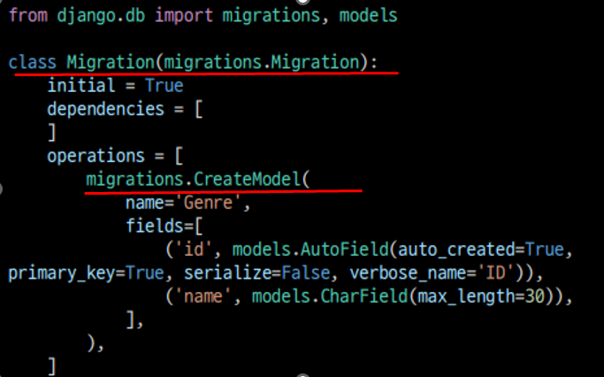


* DB 에 migrate 한다. 

```bash
$ python manage.py migrate
```

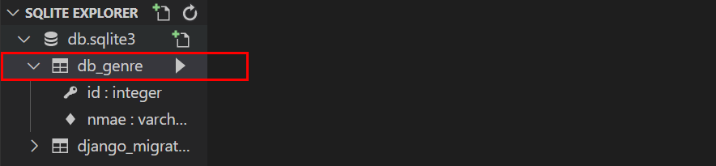


#### 💡  Migration _ model에 생긴 변화를 DB에 반영하기 위한 방법 

* Migration 파일을 만들어 DB **스키마를 반영**한다. 

* Migrate : **마이그레이션을 DB에 반영**


**👉 그럼 어떠한 변화들이 있죠?** 

* 클래스를 생성한다 = 테이블 생성

* 필드 변경 (수정 or 삭제 or 추가)  = **클래스를 수정 = >  makemigrations => Migrate** 하면 **DB 가 바뀐다.** (ALTER 쿼리 없이도 가능)

결국, 클래스를 바꿔주면 다 알아서 바뀐다. 


**[계속 생각하기]**

* 변경사항들을 결국 DB의 차이점을 보고 만들어 주는 것 = makemigrations

* 실제 DB에 반영해주는 것 = migrate


#### ⭐ Q. 모델에 변경 사항이 생기면 뭘 해줘야 하죠? = makemigrations, migrate


**👉 migrate 살펴보기** 

```python
BEGIN;
--
-- Create model Genre
--
CREATE TABLE "db_genre" (
"id" integer NOT NULL PRIMARY KEY AUTOINCREMENT,
"name" varchar(30) NOT NULL
);
COMMIT;


# 트랜잭션_ 쿼리가 1000줄을 복붙했는데 892줄에서 오류가 발생했을때 다시 되돌리는 방법 대신 한번에 처리 할 수 있는 방법
# 중간 오류가 발생되면 롤백이 생겨서 DB에 반영을 안해줌_ 완벽하세 오류가 없어야 DB 반영이된다. 

```


* **트랜잭션 :  쪼갤 수 없는 업무 처리의 최소 단위**

> * 트랜잭션은 데이터베이스 서버에 여러 개의 클라이언트가 동시에 액세스 하거나 응용프로그램이 갱신을 처리하는 과정에서 중단될 수 있는 경우 등 데이터 부정합을 방지하고자 할 때 사용한다.
> * 트랜잭션은 서로 간섭하지 않아야 한다. 만약 쿼리 하나가 실패하면, 데이터베이스 시스템은 전체 트랜잭션 또는 실패한 쿼리를 롤백 한다. 
> * 트랜잭션은 커밋전에 언제든지 수동으로 롤백 될 수 있다. 간단한 트랜잭션의 경우 아래 양식의 SQL 언어로 데이터베이스 내에서 실행된다.

Execute several queries(DB내 갱신이 아직 적용되지 않는다.)

Commit the transaction(트랜잭션이 성공적이며, 갱신이 실제 적용됨.)


####  💡 데이터베이스 조작 _ Database API


#### Genre : Class Name / objects : Manager / all() : QuerySet API

---


### ✔ ORM 기본조작 

**(1) CREATE** 

```python
#1. CREATE 메서드 활용 
Genre.objects.create(name='발라드')

#2. 인스턴스 조작 
genre = Genre()
genre.name = '인디밴드'
genre.save()
```


**(2) READ**

```python
# 1. 전체 데이터 조회 
Genre.object.all()

# 결과 : <QuerySet [<Genre: Genre object (1)>, <Genre:Genre object (2)>]>

#2. 일부 데이터 조회 _ get
Genre.objects.get(id=1)

# 결과 : <Genre: Genre object (1)>

#3. 일부 데이터 조회 _ filter
Genre.objects.filter(id=1)

# 결과 : <QuerySet [<Genre: Genre object (1)>]>

```


**(3) UPDATE**

```python
# 1. genre 객체 활용
genre = Genre.objects.get(id=1)

# 2. genre 객체 속성 변경
genre.name = '트로트’

# 3. genre 객체 저장
genre.save()
```


**(4) DELETE**

```python
# 1. genre 객체 활용
genre = Genre.objects.get(id=1)

# 2. genre 객체 삭제
genre.delete()
```


---


### ✔ 수업예제 _ (실습) 

**⭐반드시 해줘야함⭐**_shell_plus

* ```bash
  $ python manage.py shell_plus
  ```

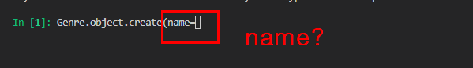

**왜 name 을 넣어줘야 하나요?** 

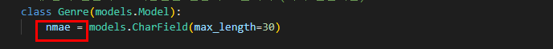

**name이라는 필드가 있기 때문**


---


### 환경설정


* ```bash
  $ python -m venv venv
  ```

> venv 확인 된다면 다음 설치를 이어나가면 된다. 

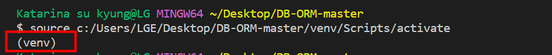


* ```bash
  $ pip install -r requirements.txt 
  ```


* ```bash
  # django 패키지 설치 확인
  $ python manage.py --version
  ```

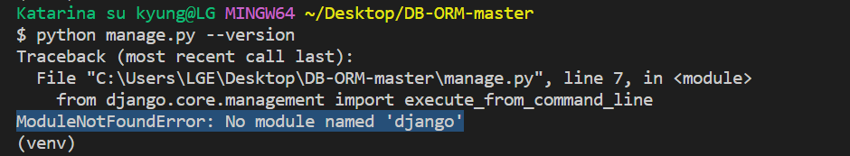

> 설치를 제대로 했지만 위와같은 에러가 발생하여 관련된 오류 사항에 대해 알아보기로 함 

> PC에 대한 권한 문제로 인해 제대로 설치가 제대로 안된것 같다는 피드백을 살펴보았다. 
>
> **관리자 권한**으로 vscode를 열어보기로 결정 


---


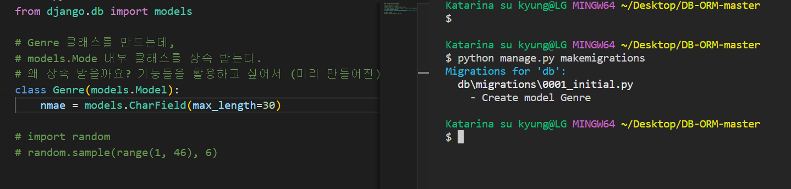


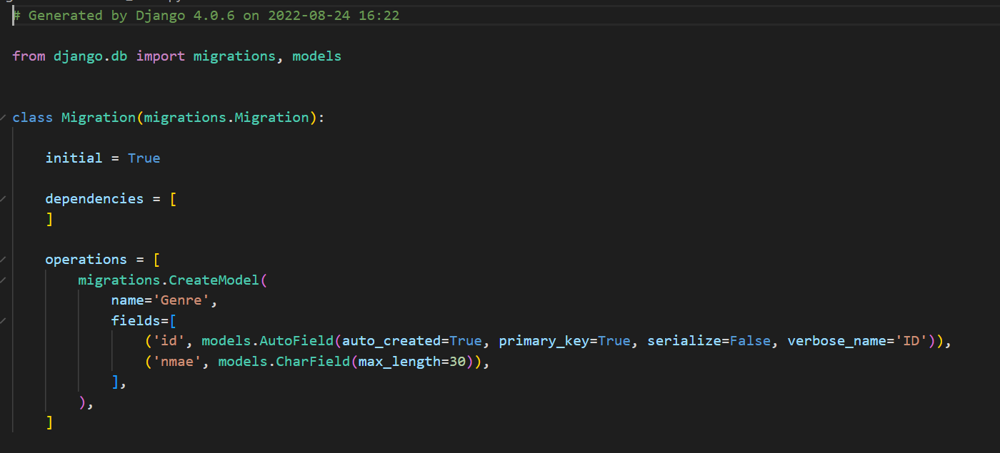


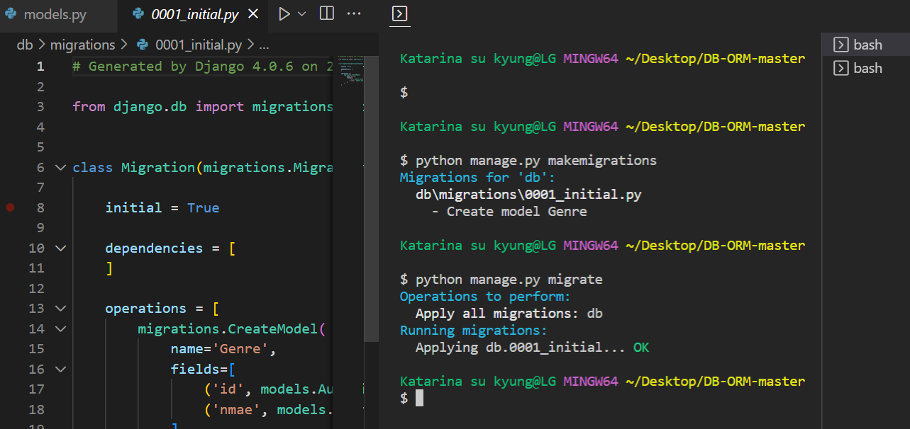


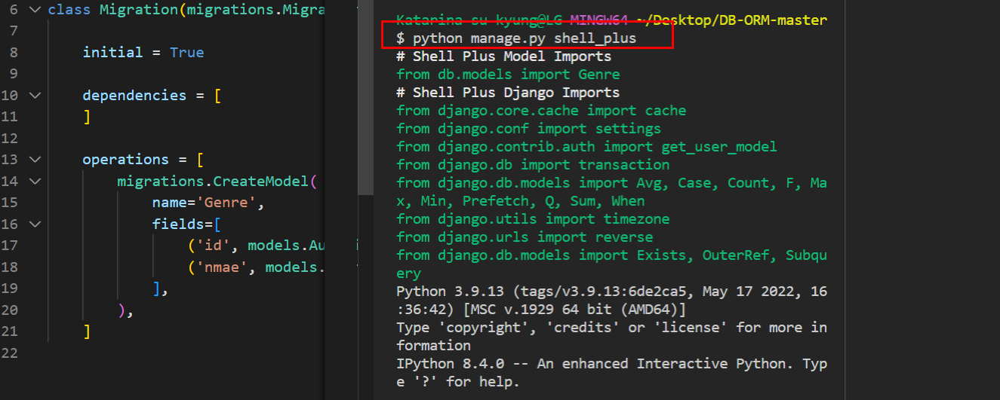


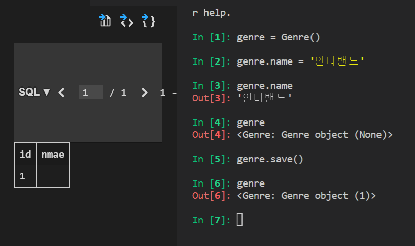


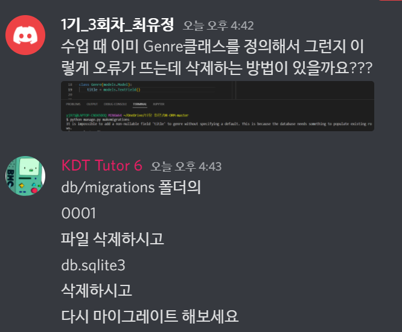