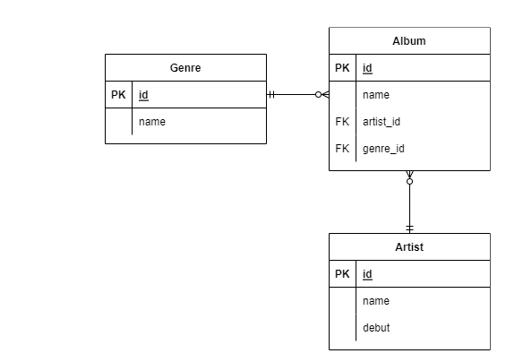

### ✔ QuerySet API

* git 

  ```sqlite
  Entry.objects.filter(id__gt=4)
  SELECT ... WHERE id > 4;
  ```

* gte

  ```sql
  Entry.objects.filter(id__gte=4)
  SELECT ... WHERE id >= 4;
  ```

* lt, lte

  ```sql
  Entry.objects.filter(id__lt=4)
  Entry.objects.filter(id__lte=4)
  ```

  ```sql
  SELECT ... WHERE id < 4;
  SELECT ... WHERE id <= 4;
  ```

* in

  ```sql
  Entry.objects.filter(id__in=[1, 3, 4])
  Entry.objects.filter(headline__in='abc')
  ```

  ```sql
  ELECT ... WHERE id IN (1, 3, 4);
  SELECT ... WHERE headline IN ('a', 'b', 'c')
  ```

* startswith

  ```sql
  Entry.objects.filter(headline__startswith='Lennon')
  ELECT ... WHERE headline LIKE 'Lennon%';
  ```

* istartswith

  ```sql
  Entry.objects.filter(headline__istartswith='Lennon')
  SELECT ... WHERE headline ILIKE 'Lennon%';
  ```

* endswith

  ```sql
  Entry.objects.filter(headline__endswith='Lennon’)
  Entry.objects.filter(headline__iendswith='Lennon')
  ```

  ```sql
  SELECT ... WHERE headline LIKE '%Lennon';
  SELECT ... WHERE headline ILIKE '%Lennon'
  ```

* contains

  ```sql
  Entry.objects.get(headline__contains='Lennon’)
  Entry.objects.get(headline__icontains='Lennon’)
  ```

  ```sql
  SELECT ... WHERE headline LIKE '%Lennon%’;
  SELECT ... WHERE headline ILIKE '%Lennon%';
  ```

* range

  ```sql
  import datetime
  start_date = datetime.date(2005, 1, 1)
  end_date = datetime.date(2005, 3, 31)
  Entry.objects.filter(pub_date__range=(start_date, end_date))
  ```

  ```sql
  SELECT ... WHERE pub_date
  BETWEEN '2005-01-01' and '2005-03-31';
  ```

* 복합 활용 (1)

  ```sql
  inner_qs = Blog.objects.filter(name__contains='Cheddar')
  entries = Entry.objects.filter(blog__in=inner_qs)
  ```

  ```sql
  SELECT ...
  WHERE blog.id IN (SELECT id FROM ... WHERE NAME
  LIKE '%Cheddar%’);
  ```

* 복합 활용 (2)

  ```sql
  Entry.objects.all()[0]
  SELECT ...
  LIMIT 1;
  ```

* 복합 활용 (3)

  ```sql
  Entry.objects.order_by('id')
  SELECT ...
  ORDER BY id;
  ```

* 복합 활용 (4)

  ```sql
  Entry.objects.order_by(‘-id')
  SELECT ...
  ORDER BY id DESC;
  ```

  

---


### ✔ ORM 확장 _ 1:M 



```python
class Genre(models.Model):
name = models.CharField(max_length=30)

class Artist(models.Model):
name = models.CharField(max_length=30)
debut = models.DateField()

class Album(models.Model):
name = models.CharField(max_length=30)
genre = models.ForeignKey('Genre',on_delete=models.CASCADE)
artist = models.ForeignKey('Artist',on_delete=models.CASCADE)
```


* **Foreign Key (외래키)**
  *  키를 사용하여 부모 테이블의 유일한 값을 참조 (참조 무결성)
  * 데이터베이스 관계 모델에서 관련된 2개의 테이블 간의 일관성
  * 외래 키의 값이 반드시 부모 테이블의 기본 키일 필요는 없지만 유일한 값이어야 함
* **models.ForeignKey 필드 (2개의 필수 위치 인자)**
  * Model class : 참조하는 모델
  * on_delete : 외래 키가 참조하는 객체가 삭제되었을 때 처리 방식
    * **CASCADE** : 부모 객체(참조 된 객체)가 삭제 됐을 때 이를 참조하는 객체도 삭제
    * **PROTECT** : 삭제되지 않음
    * **SET_NULL** : NULL 설정
    * **SET_DEFAULT** : 기본 값 설정


>  **CASCADE** :  부모 객체 (참조 된 객체)가 삭제 됐을 때 이를 참조하는 객체도 삭제 _댓글을 지워야 한다. 

>  PROTECT : 삭제 되지 않음 _ 댓글이 있으면 글 지우지 못하게 함 


만약 댓글 포인트 제도_댓글을 통한 등업 제도 _ 댓글을 지운다면 

=> 어떻게 구현하느냐에 따라서 달라지는 부분들이다. (다양하게 생각하기)


지우지 않았지만 지워진것처럼 보이기 (휴면 회원)

_ 필드를 만들고 **IS_DELETE** or **IS_ACTIVE**  **1 OR 0**으로 관리 ) SOFT DELETE 라고도 불린다. 

_ GitHub 유령 프로필 (탈퇴한 회원이지만 댓글을 남겨놓은 상황)


* Create

* ```sql
  artist = Artist.objects.get(id=1)
  genre = Genre.objects.get(id=1)
  album = Album()
  album.name = '앨범1'
  album.artist = artist # 1. 객체의 저장
  album.genre = genre
  album.save()
  ```

  


* **꼭 질문하는 것_**

⭐ 장르라는 필드(g**enre = models.ForeignKey('Genre', on_delete = models.CASCADE**))를 추가했는데 실제로는 **genere_id** 라고 되어있다. 

⭐ ForeignKey 를 사용하면 genere_id _ id가 붙인다. 

---


